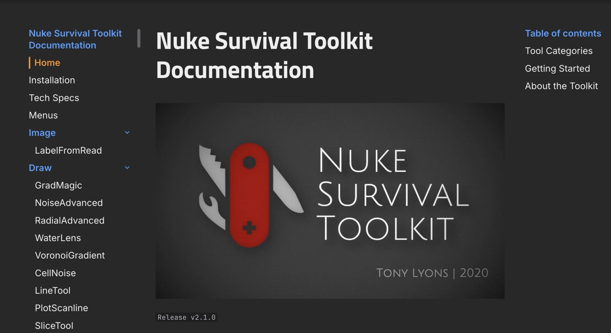

# NukeSurvivalToolkit Wiki

Live Online Wiki: <https://creativelyons.github.io/NukeSurvivalToolkit_Wiki/>

[](https://creativelyons.github.io/NukeSurvivalToolkit_Wiki/)

## Repository Layout

This repository contains the source and deployment setup for the NST wiki.

- Docs source: `documentation/docs/`
- MkDocs config: `documentation/mkdocs.yml`
- Local build output: `documentation/site/` (ignored)
- CI deploy workflow: `.github/workflows/mkdocs.yml`

## Deployment

Deployment is handled by GitHub Actions via `.github/workflows/mkdocs.yml` when changes are pushed to `main` under `documentation/**`.

## Options for Offline Documentation:

## A. Build From Source (Offline Wiki)

Requirements:

- Python 3.x
- `mkdocs`
- `mkdocs-material`

Build:

```bash
cd documentation
mkdocs build
```

Serve locally:

```bash
cd documentation
mkdocs serve -a 127.0.0.1:8010
```

Open:

<http://127.0.0.1:8010/>

## B. Offline Wiki (Prebuilt ZIP Release Asset)

A prebuilt static wiki ZIP will be provided in GitHub Releases so users can run the documentation offline without building from source.

When available, download the latest release asset ZIP from the Releases page, unzip it anywhere on your machine, and open `index.html` (or serve the folder locally) to browse the full wiki offline.

Releases:

<https://github.com/CreativeLyons/NukeSurvivalToolkit_Wiki/releases>

## C. Offline Wiki (PDF Reference)

For a simple offline reference version of the documentation, use the PDF:

- [NukeSurvivalToolkit_Documentation_Release_v2.1.0.pdf](documentation/NukeSurvivalToolkit_Documentation_Release_v2.1.0.pdf)


## Changelog

Project change history is tracked in `CHANGELOG.md`.
