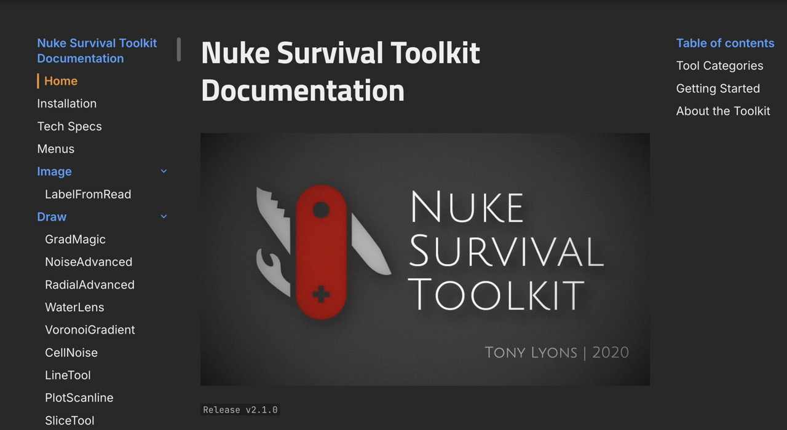

# NukeSurvivalToolkit Wiki

Live Online Wiki: <https://creativelyons.github.io/NukeSurvivalToolkit_Wiki/>

[](https://creativelyons.github.io/NukeSurvivalToolkit_Wiki/)

## Repository Layout

This repository contains the source and deployment setup for the NST wiki.

- Docs source: `documentation/docs/`
- MkDocs online config (GitHub Pages): `documentation/mkdocs.yml`
- MkDocs offline config (ZIP/local file mode): `documentation/mkdocs.offline.yml`
- Local build output: `documentation/site/` (ignored)
- CI deploy workflow: `.github/workflows/mkdocs.yml`

## Deployment

Deployment is handled by GitHub Actions via `.github/workflows/mkdocs.yml` when changes are pushed to `main` under `documentation/**`.
CI builds with `documentation/mkdocs.yml` (online config).

## Options for Offline Documentation:

## A. Build From Source (Offline Wiki)

Requirements:

- Python 3.x
- `mkdocs`
- `mkdocs-material`

Build:

```bash
cd documentation
mkdocs build -f mkdocs.offline.yml
```

Serve locally:

```bash
cd documentation
mkdocs serve -f mkdocs.offline.yml -a 127.0.0.1:8010
```

Open:

<http://127.0.0.1:8010/>

## B. Offline Wiki (Prebuilt ZIP Release Asset)

A prebuilt static wiki ZIP will be provided in GitHub Releases so users can run the documentation offline without building from source.

When available, download the latest release asset ZIP from the Releases page, unzip it anywhere on your machine, and open `site/index.html` (or serve the `site/` folder locally) to browse the full wiki offline.

Releases:

<https://github.com/CreativeLyons/NukeSurvivalToolkit_Wiki/releases>

## C. Offline PDF Build (Local, Not Versioned)

The main PDF entrypoint for this repo is the root-level Python script `./make_wiki_pdf`.
Its purpose is to generate the printable PDF documentation from the wiki source, first as approved section builds and eventually as the complete assembled PDF book.

Current implemented targets:

- `cover`
- `about-installation`
- `technical-details`
- `menu`
- `contact`
- `special-thanks`
- `pages-1-2`
- `pages-1-5`
- `full-so-far`
- `full-wiki`

The content-backed slice targets now render from the wiki markdown source (`intro.md`, `techSpecs.md`, `menus.md`, `special-thanks.md`, `contact.md`) so the wiki and the printable subset builds stay aligned while preserving the approved PDF shell. `about-installation` keeps its approved front-matter styling, but its content now comes from `intro.md`.

The older `page2` target name still works as a legacy alias, but `about-installation` is now the canonical name.

The finished review PDFs now receive page numbers in one final stamping pass, so the cover and interior pages share the same numbering position.

The merged full-book path now keeps the approved main pages and the tool pages as separate sources of truth:

- `./make_wiki_pdf full-so-far` remains the approved non-tool main-page review build.
- `./make_tool_pages_pdf tool-pages` remains the tool-pages-only build path.
- `./make_wiki_pdf full-wiki` builds both outputs separately, inserts a generated `Tool Index`, merges them as front main pages -> Tool Index -> tool pages -> Special Thanks / Contact, stamps one consecutive page-number sequence across the merged result, and injects clickable TOC links plus PDF sidebar bookmarks into the finished file.

For faster tool-page iteration, `./make_tool_pages_pdf tool-pages` still supports `--category` flags to render one or more tool menus without touching the approved main-page build path.

For faster full-book TOC/layout validation, `./make_wiki_pdf full-wiki --category draw` keeps the approved main pages and generated Tool Index, but limits the rendered tool section to a single tool category.

Requirements:

- Google Chrome installed locally
- A Python interpreter with `playwright` available
- Python packages from `documentation/requirements-pdf.txt` (includes `pypdf` for final page-number stamping and Tool Index link injection)
- Poppler CLI tools `pdfinfo`, `pdfseparate`, and `pdfunite` available on `PATH`

Generated PDFs are local build artifacts for inspection and should not be committed.

## D. Offline Wiki (PDF Reference)

For the original offline reference version of the documentation, use the PDF:

- [NukeSurvivalToolkit_Documentation_Release_v2.1.0.pdf](documentation/NukeSurvivalToolkit_Documentation_Release_v2.1.0.pdf)


## Changelog

Project change history is tracked in `CHANGELOG.md`.
