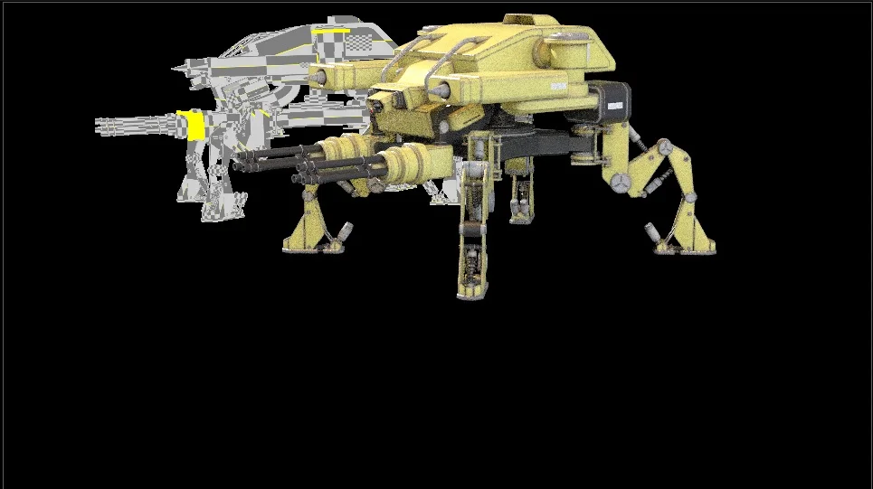
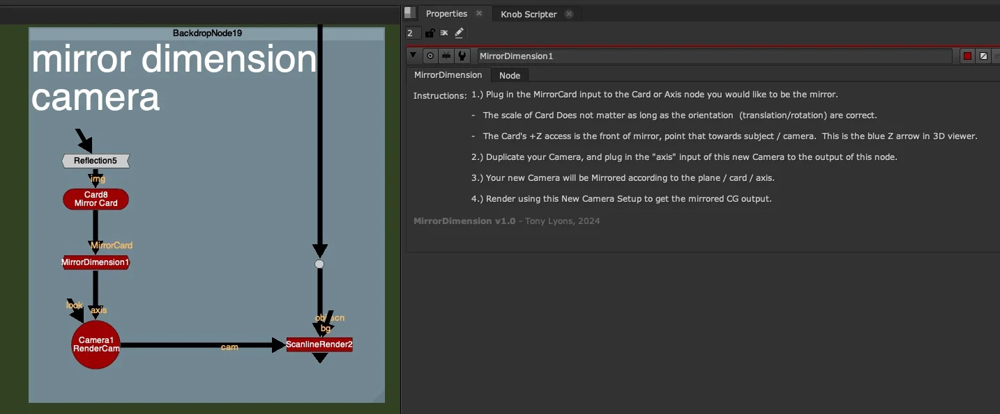
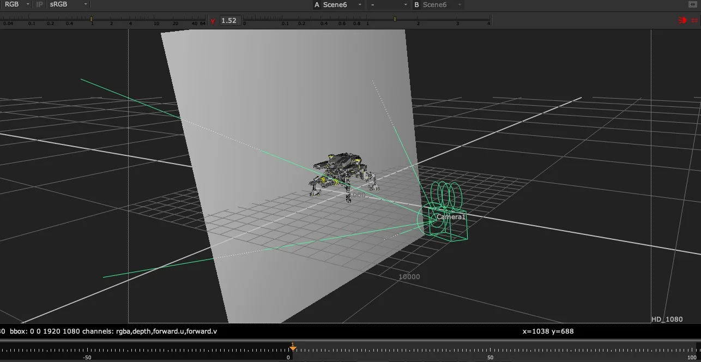
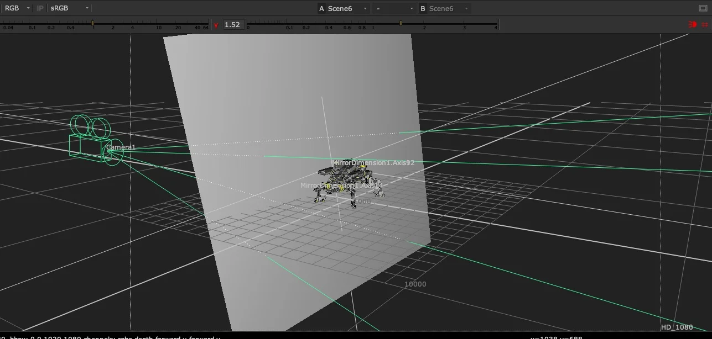

# MirrorDimension TL

**Author:** Tony Lyons - [https://compositingmentor.com](https://compositingmentor.com)

- [http://www.nukepedia.com/gizmos/3d/mirrordimension](http://www.nukepedia.com/gizmos/3d/mirrordimension)
- [https://compositingmentor.com/2024/04/02/cg-compositing-series-2-5-material-aovs-refractions-reflections/](https://compositingmentor.com/2024/04/02/cg-compositing-series-2-5-material-aovs-refractions-reflections/)

Plug this gizmo between your Camera and a 3D Card and it will mirror — or "flip" — the Camera to the other side of the Mirror Card. The result is a new virtual camera positioned to render the scene from the mirror's perspective, with full AOVs.

The node acts as an Axis, mathematically flipping the world along the orientation of the Card input. No manual matrix math needed.

### Why Render Reflections This Way?

The Mirror Card technique gives you reflections with **full AOVs** — diffuse, specular, transmission, whatever your renderer outputs. This is in contrast to pulling from a single baked Indirect Specular pass, which locks all that information together. With a separately rendered mirror camera, you can grade, composite, and adjust each pass independently.

### Use Cases

- **Ground plane reflections** — angle a card flat on the ground, mirror the camera, render, and composite back in
- **Any planar reflective surface** — walls, windows, polished floors, water
- **Best case:** take the mirrored camera back into your 3D application and re-render the reflection angle with full AOVs
- **In-Nuke workaround:** use with projected geometry or a Position Point Cloud (PositionToPoints) to fake reflections entirely inside Nuke

### Setup

1. **Connect the MirrorCard input** to the Card or Axis node you want to act as the mirror plane
   - Scale doesn't matter — only translation and rotation are used
   - The Card's +Z axis is the front of the mirror — point it towards the subject and camera (the blue Z arrow in the 3D viewer)
2. **Duplicate your Camera** and plug the output of MirrorDimension into its **axis** input
3. Your duplicated camera is now mirrored across the plane
4. **Render with the new camera** to get the mirrored CG output

**Input:** MirrorCard (Card or Axis node)

