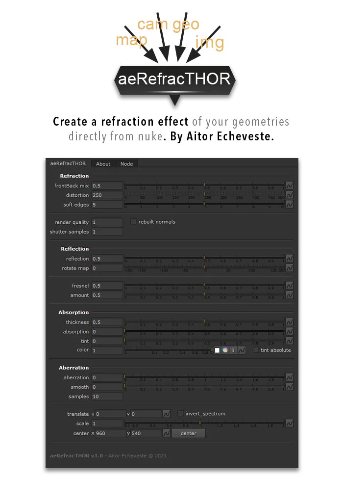

# aeRefracTHOR AE

**Author:** Aitor Echeveste

- [https://www.nukepedia.com/tools/gizmos/filter/aerefracthor/](https://www.nukepedia.com/tools/gizmos/filter/aerefracthor/)
- Video: [https://vimeo.com/574578942](https://vimeo.com/574578942)

Realistic refraction effects gizmo. Creates refraction effects using geometry and a camera; simulates optical effects similar to glass.

