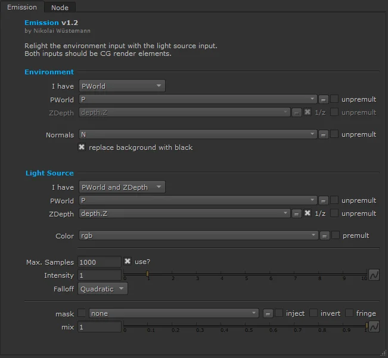
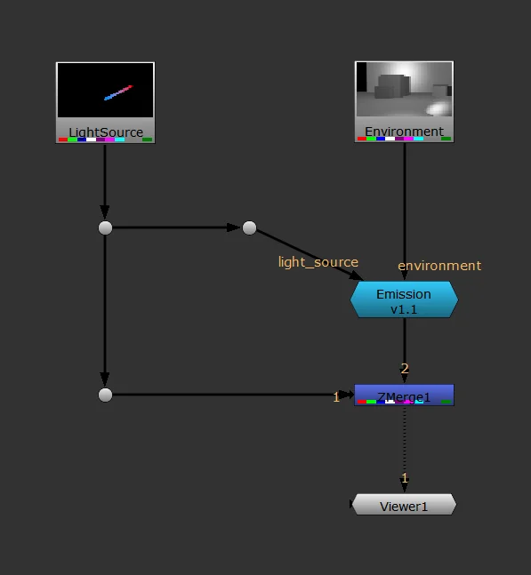
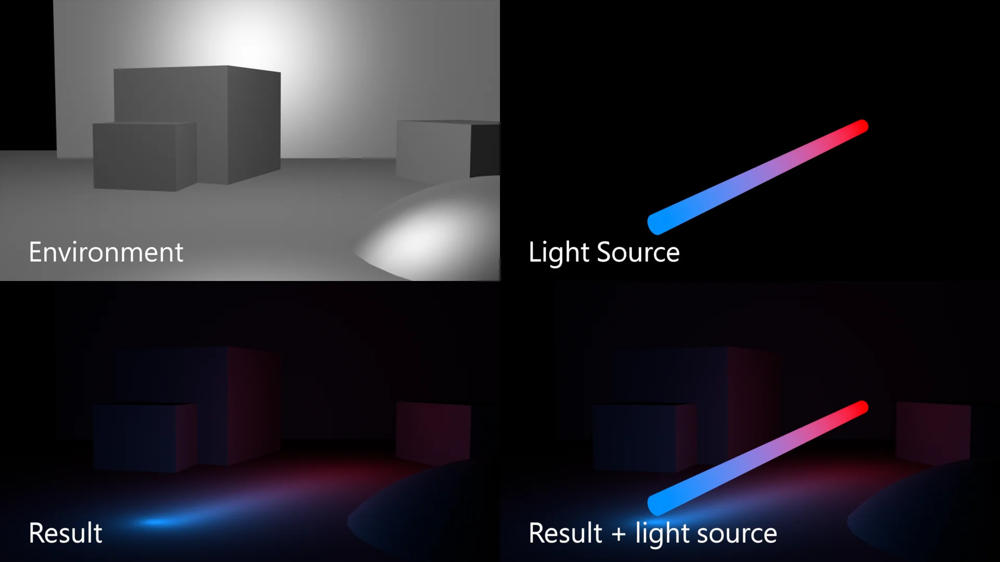
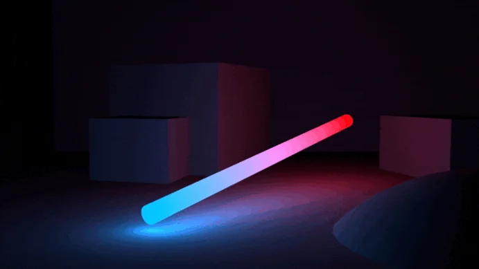

# Emission NW

**Author:** Nikolai Wüstemann

<video autoplay loop muted playsinline style="width: 100%; max-width: 800px;">
  <source src="../img/tools/cg/emission-hero.mp4" type="video/mp4">
</video>

- [https://www.nukepedia.com/tools/gizmos/other/emission/](https://www.nukepedia.com/tools/gizmos/other/emission/)

Relight a CG render with another CG render. No geo needed.

If you have a rendering that should emit light to your scene, but you have no interactive light pass, there is not all hope lost. If you can manage to get your hands on a rendering of your environment, for example by using a Lidar scan + ScanlineRender, you can then use Emission to emit light from your FX or CG element onto your environment.

**Light source with PWorld and ZDepth; Environment with PWorld and Normals:**

