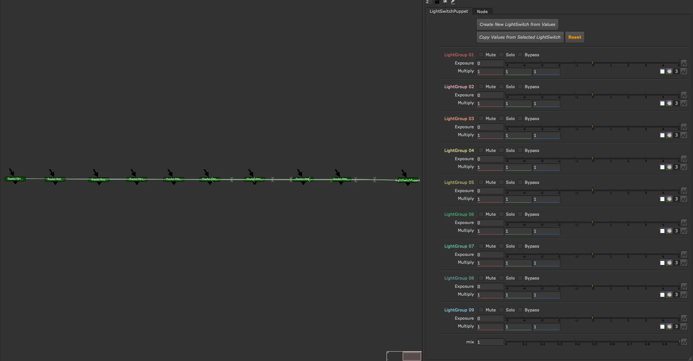
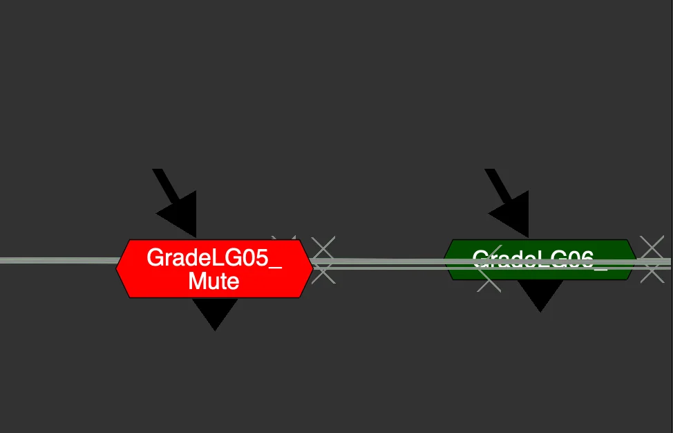
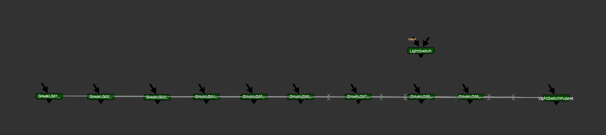

# LightSwitch Puppet

**Author:** Tony Lyons - [https://www.CompositingMentor.com](https://www.CompositingMentor.com)

A CG AOV tool for compositors, designed for use in additive CG rebuild templates. Like LightSwitch, it controls light group exposure and colour — but all corrections live outside the node as explicit Grade nodes in the graph, giving compositors full visibility and access to each light group's adjustments.

For the implicit version with all corrections contained inside the group, see [LightSwitch](light-switch.md).

## Setup

Start by assigning the appropriate layers to each light group. Light group names are unique to your render software and pipeline — the tool defaults to LG01, LG02, etc., but select whichever layers you need. This setup can be done once and reused in a CG compositing template.

## Controls Per Light Group

Each light group has two colour correction controls:

- **Exposure** — adjust brightness
- **Multiply** — adjust colour

These can be round-tripped back to the lighting application for iteration.

Each light group also has three toggles:

- **Mute** — disable or ignore this light group.
- **Solo** — disable all other light groups, show only this one
- **Bypass** — ignore the Exposure and Multiply corrections; use to toggle changes on/off

> When a light group is muted, the corresponding GradeLG node turns red and displays "Muted" — making it immediately visible in the graph which light groups are inactive.

> Enabling **Solo** on multiple light groups simultaneously adds them together — useful for isolating or troubleshooting individual lights.

All controls on the LightSwitch Puppet interface directly drive the individual GradeLG nodes placed in the comp, numbered to match their corresponding light group.

## Global Controls

- **Mix** — overall blend of all corrections

Note: the mask input is not included on the Puppet, since the group itself has no internals.

## Disabling the Node

Disabling the LightSwitch Puppet node bypasses all connected GradeLG nodes simultaneously — a fast way to toggle your entire light group adjustment on and off without touching each grade individually.

## LightSwitch vs LightSwitch Puppet

| | LightSwitch | LightSwitch Puppet |
| --- | --- | --- |
| Corrections | Inside the group (implicit) | Linked grades, placed explicitly in the comp |
| Best for | Lighters, slapcomps | Compositors, CG templates |
| Node count | Fewer | More, but fully visible and customisable |

## Bridging the Two Workflows

Two buttons at the top of the node allow compositors and lighters to share work across both tools.

**Create New LightSwitch from Values**
Copies the current LightSwitch Puppet settings and generates a single LightSwitch node with the same values. Use this to hand off a compositing template setup back to lighting — or to consolidate your adjustments into a single contained node to plug directly into a CG render.

**Copy Values from Selected LightSwitch**
Select another LightSwitch or LightSwitch Puppet node first — from another script, template, or slapcomp — then click this to transfer its settings onto the current node. Supports both directions:

- Another LightSwitch → This LightSwitch Puppet
- LightSwitch Puppet → This LightSwitch Puppet

