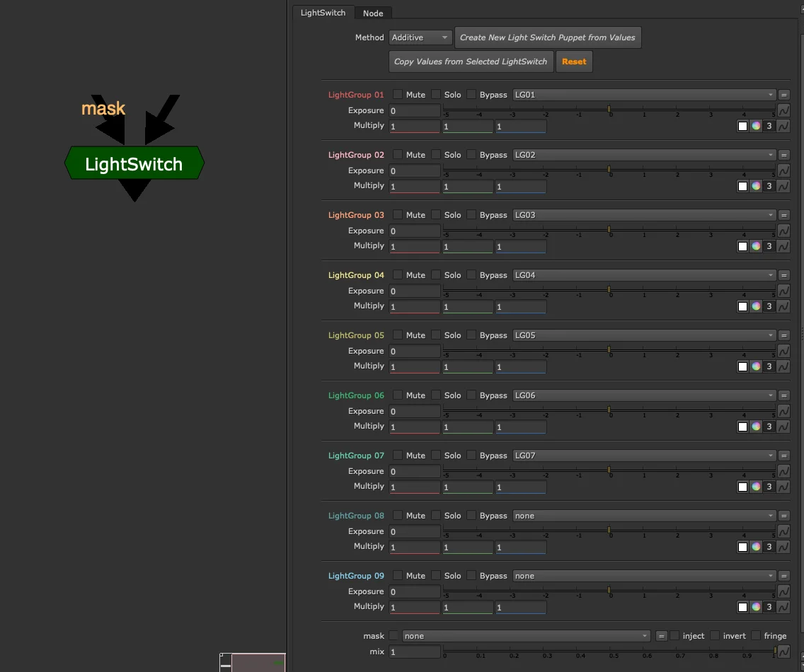
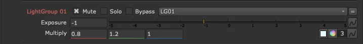

# LightSwitch

**Author:** Tony Lyons - [https://www.CompositingMentor.com](https://www.CompositingMentor.com)

A CG AOV tool primarily for lighters, used to quickly adjust light groups in a slapcomp. All corrections live inside the group node — implicit, contained, and fast to work with.

For an explicit version designed for larger CG compositing templates, see [LightSwitch Puppet](light-switch-puppet.md).

## Setup

Start by assigning the appropriate layers to each light group. Light group names are unique to your render software and pipeline — the tool defaults to LG01, LG02, etc., but select whichever layers you need. This setup can be done once and saved into a lighting slapcomp template.

## Controls Per Light Group

Each light group has two colour correction controls:

- **Exposure** — adjust brightness
- **Multiply** — adjust colour

These map directly to lighting parameters and can be round-tripped back to the lighting application for iteration.

Each light group also has three toggles:

- **Mute** — disable this light group
- **Solo** — disable all other light groups, show only this one
- **Bypass** — ignore the Exposure and Multiply corrections; use to toggle changes on/off

Enabling **Solo** on multiple light groups simultaneously adds them together — useful for isolating a particular light or troubleshooting light contributions.

## Global Controls

- **Method** — how light groups are combined (additive or subtractive)
- **Mix** — overall blend of the corrections
- **Mask** — limit corrections to a masked region

## LightSwitch vs LightSwitch Puppet

| | LightSwitch | LightSwitch Puppet |
| --- | --- | --- |
| Corrections | Inside the group (implicit) | Linked grades, placed explicitly in the comp |
| Best for | Lighters, slapcomps | Compositors, CG templates |
| Node count | Fewer | More, but fully visible and customisable |

## Bridging the Two Workflows

Two buttons at the top of the node allow lighters and compositors to share work across both tools.

### Create New LightSwitch Puppet from Values
Copies the current LightSwitch settings and generates a LightSwitch Puppet setup with the same values. Use this to transition from a quick lighting slapcomp into a full CG compositing template without re-entering your adjustments.

### Copy Values from Selected LightSwitch
Select another LightSwitch (or LightSwitch Puppet) node first — from another script, template, or slapcomp — then click this to transfer its settings onto the current node. Supports both directions:

- Another LightSwitch → This LightSwitch
- LightSwitch Puppet → This LightSwitch
