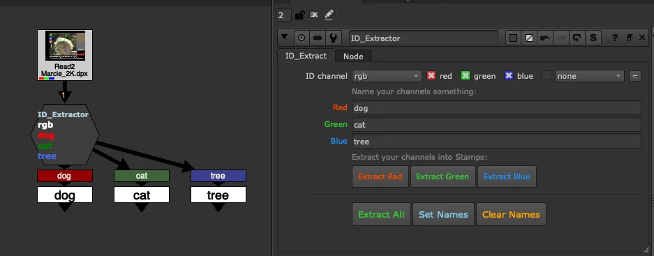

# ID Extractor

**Author:** Tony Lyons - [https://www.CompositingMentor.com](https://www.CompositingMentor.com)

A utility gizmo for pulling out red, green, and blue channels from an RGB ID layer. Designed to be explicit, visual, and easy to use. Works best alongside [Stamps](https://adrianpueyo.com/stamps/) by Adrian Pueyo, and is well suited for roto ingestions as well as CG ID layers from lighting or FX renders.

### Usage

Enter a name for each channel — red, green, and blue. It is fine to leave a field blank if the channel is unused or unknown; names can be added later.

Once channels are named, you can extract Red, Green, or Blue individually, or click **Extract All** to process everything at once.

**Extract All** is the all-in-one button. It performs three actions in sequence:

1. **Set Names** — updates the node label so each channel name is displayed in its corresponding red, green, or blue font colour.
2. Creates colour-coordinated Shuffle nodes, making it immediately clear which source channel each output came from.
3. Instantly creates Stamp anchors using the same names, so each ID is ready to reference elsewhere in the comp by its layer name.

You can also run **Set Names** and **Clear Names** independently as needed.

### Use Cases

- **Roto ingestion** — quickly assign channel names to an ingested roto package and extract them with colour-coded Shuffles and Stamps in one click.
- **CG ID layers** — name the channels in a lighting or FX ID render, then extract them with full visual clarity as to which channel each element originated from.
