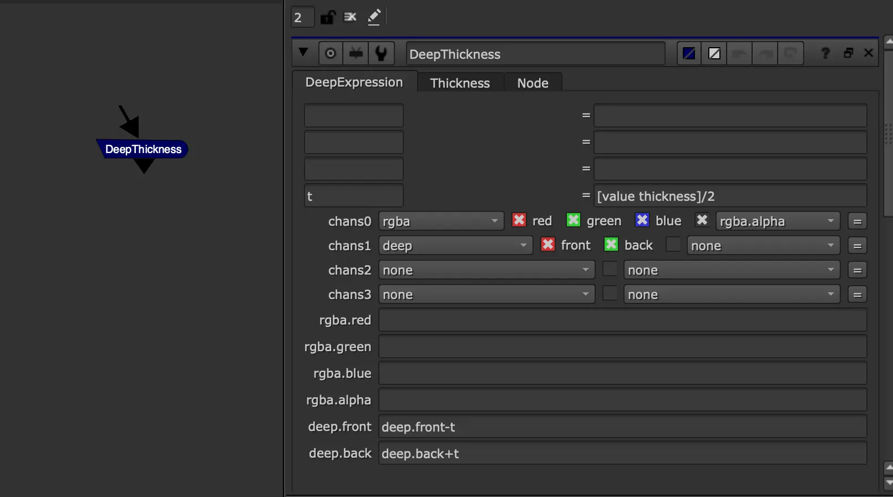

# Deep Thickness [AG]

**Author:** Andrea Geremia

- [http://www.andreageremia.it/tutorial_expression_node.html](http://www.andreageremia.it/tutorial_expression_node.html)
- [http://www.nukepedia.com/gizmos/other/expression-node-collection-for-nuke](http://www.nukepedia.com/gizmos/other/expression-node-collection-for-nuke)

From Expression AG menu.

Adds thickness to deep samples by expanding the front and back of each layer symmetrically. The **Thickness** knob sets the total amount; the node splits it in half and subtracts from `deep.front` while adding to `deep.back`, effectively growing each sample in both directions equally. Useful for smoothing elements through deep smoke or volumetric passes where samples have very thin or zero depth.
