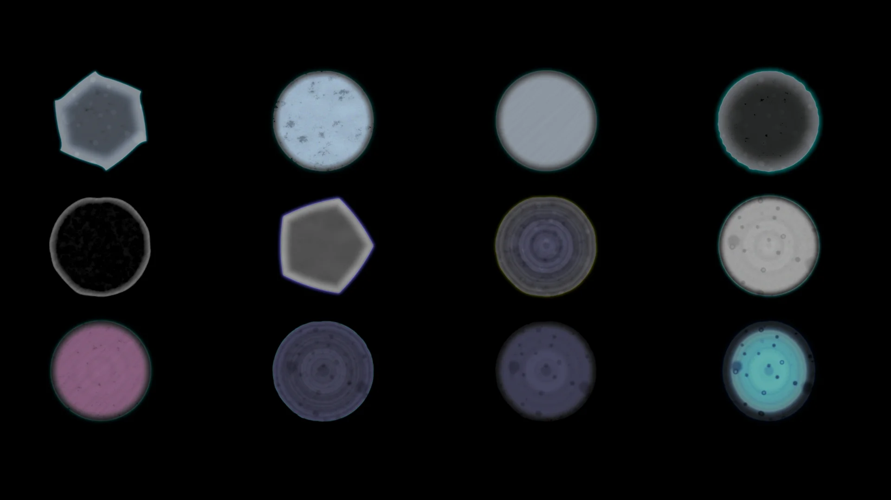
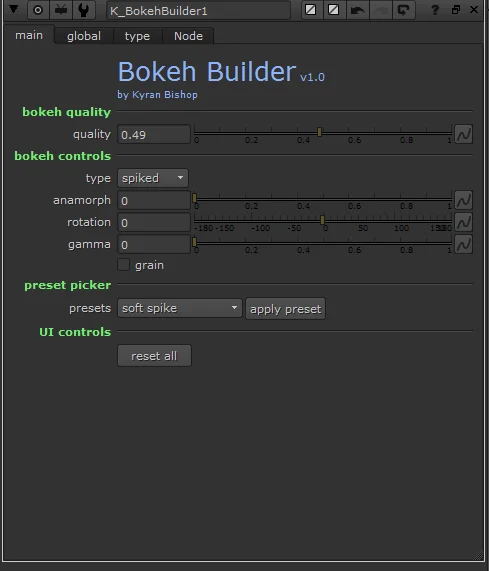
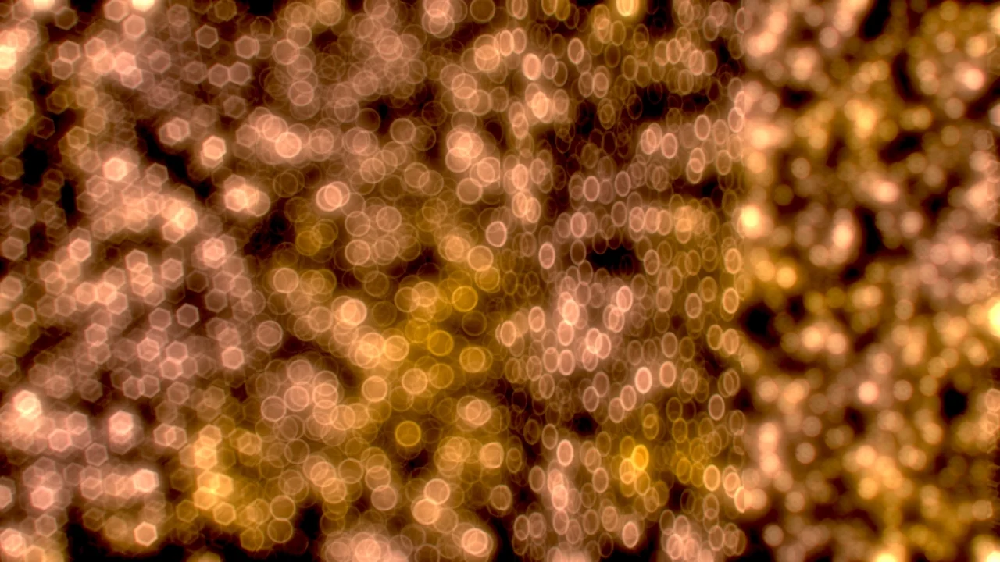

# BokehBuilder KB

**Author:** Kyran Bishop - [https://www.kyranbishop3d.com](https://www.kyranbishop3d.com)

- [https://www.nukepedia.com/tools/gizmos/draw/bokeh-builder/](https://www.nukepedia.com/tools/gizmos/draw/bokeh-builder/)

Procedurally generates custom bokeh shapes to drive defocus effects. Use the output as a kernel in a lens blur or convolve node to achieve artistic and physically-grounded out-of-focus looks.

Two base types are available — **circular** and **spiked** — each with its own sub-type picker. A preset library with twelve named looks lets you get started quickly, or build a shape from scratch using the layered controls.

### Controls

- **Quality** — sets the render quality of the bokeh kernel
- **Anamorph** — stretches the shape horizontally, simulating anamorphic lens bokeh
- **Rotation** — rotates the entire shape
- **Gamma** — adjusts overall falloff
- **Grain** — adds fine grain texture to the shape

### Noise layers

- **Noise** — procedural noise with controls for size, gain, gamma, and strength
- **Natural noise** — five organic noise types: wavy, streaks, blobs, spiky blobs, inverted blobs
- **Rings** — adds concentric ring detail with thickness and strength controls

### Chromatic effects

- **Inner chroma** — chromatic aberration inside the shape with tint, size, and falloff
- **Outer chroma** — chromatic aberration around the edge with tint, size, and strength
- **Distortion** — warps the shape using a noise field with size, detail, and strength

