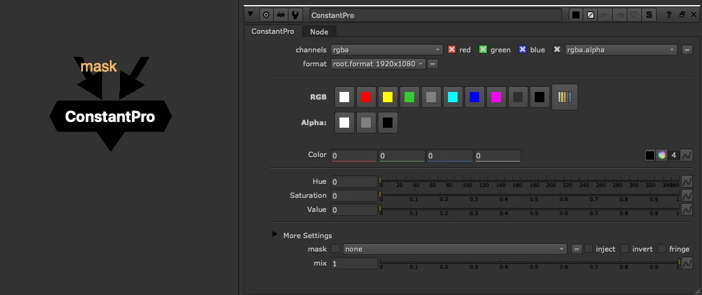
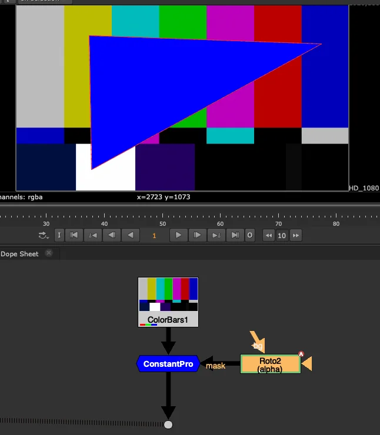

# ConstantPro TL

**Author:** Tony Lyons - [https://compositingmentor.com](https://compositingmentor.com)

An enhanced replacement for Nuke's native Constant node, built for speed and look dev.

### Color Presets

- Quick one-click colors: red, green, blue, magenta, cyan, yellow, white, black, 18% grey, 50% grey
- **Random Color** button — picks a random hue (feeling lucky?)
- Node tile color updates automatically to match the selected preset

### Adjustments

- **HSV sliders** — tweak hue, saturation, and value directly in the properties, no color wheel needed
- **Alpha presets** — instantly set to 0, 0.5, or 1
- **Smart overscan** — inherits overscan from the input, useful for overscanned CG and dynamic format templates

### Stream Integration & Mask

ConstantPro can be plugged directly into the image stream. Combined with its **mask input**, this lets you quickly paint a solid color into any area without extra nodes — no Merge, no Grade, just roto and go.

### Under the Hood

Built on Nuke's little-known **Fill** node, which bypasses all upstream processing entirely — ZDefocus, Median, ScanlineRender, whatever is connected before it simply doesn't evaluate. Only the constant color is processed, making it genuinely lightweight.

> **Note:** the bypass only applies when **no mask is connected**. With a mask, Nuke must evaluate upstream to know what to reveal.

**Inputs:** img (optional, for format) · mask

