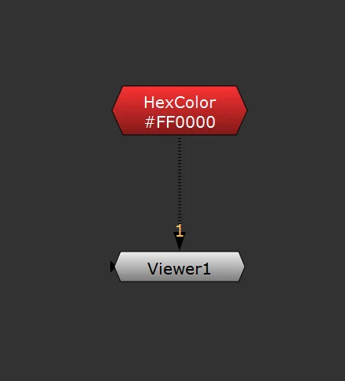
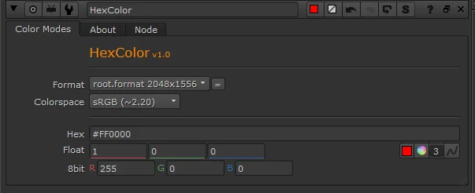

# HexColor NW

**Author:** Nikolai Wüstemann

- [https://www.nukepedia.com/gizmos/colour/hexcolor](https://www.nukepedia.com/gizmos/colour/hexcolor)

Allows input of color values in multiple formats (hex, float, RGB 8-bit) with live conversion. Works like a Constant node with flexible color input—hex, float, or RGB 8-bit; changing any value updates all others.

