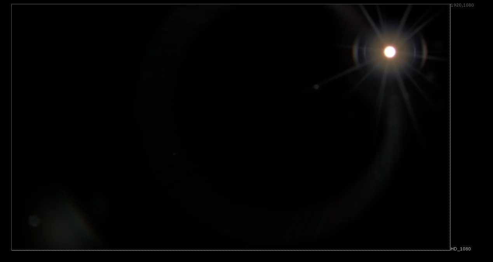
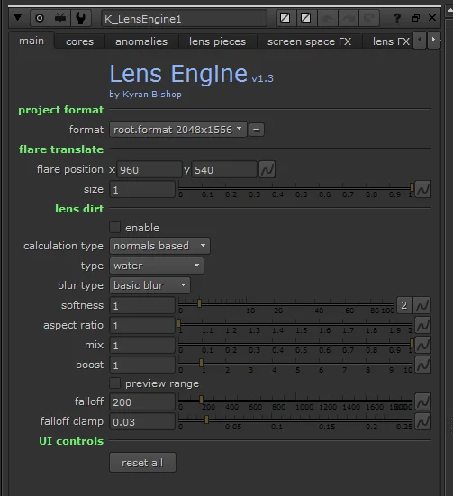

# LensEngine KB

**Author:** Kyran Bishop - [https://www.kyranbishop3d.com](https://www.kyranbishop3d.com)

- [https://www.nukepedia.com/tools/gizmos/draw/lens-engine/](https://www.nukepedia.com/tools/gizmos/draw/lens-engine/)

A lens flare, lens FX, glass reflection and lens simulator for Nuke.

Lens flares! JJ Abrams loves them, and now **you** can love them too. This gizmo was built as part of a research project looking into flares and drawing certain elements of flares in an easy-to-use and clear way.

A lot of the design elements of the tool are adapted from Doug Hogan's Flare Factory, and the glass reflections from Vincent Wauters' Auto Flare, but with improved concatenation and a bunch more additional features and elements to draw. The main goal of this project was to combine existing tools into one 'super' lens flare tool, and improve the features and UI along the way. Lens Engine should be a little faster and clearer to use than Flare Factory, but of course Doug gets the credit for the design of the spectacular elements and pieces that make up the flares - I just cleaned things up a little.

### New features include

- Sped up node graphs with cleaner concatenation
- The ability to use custom lens dirt images
- 'Normals-based' lens dirt, ensuring that the dirt is illuminated from the light source
- Clearer and more-compact UI
- The ability to preview all falloff radiuses and masks when adjusting keying tolerance and radials
- 'Dog schidt' optics (these are still WIP and prone to breaking sometimes)
- Frame ghosting and glass reflections
- The ability to calculate most post FX either pre-flare, or post-flare
- Additional screen space FX such as center blooming and edge blooming
- Photographically-based bloom FX, allowing for striped bloom or sharp radial bloom
- Lens FX such as vignetting, edge blur, chroma shifting and lens distortion
- Global size controls adjusting all features of the lens flare
- Additional elements to draw

I also created Bokeh Builder as part of this project, so check that out too for some natural looking bokeh shapes!

Some parts are a little rickety so may take some fine tuning and I'm still working on building presets - but it's getting there. If there are any problems at all please contact me and I'll get on some bug fixes straight away.

Seeing as this was part of a research project, I'm also looking for feedback on the gizmo. There's a 1minute survey here for logging people's thoughts on it, so if you download the tool and have some feedback then please do fill it in [http://goo.gl/forms/cl1tgdVtUD](http://goo.gl/forms/cl1tgdVtUD) - any feedback is useful!

Thanks for your support!

