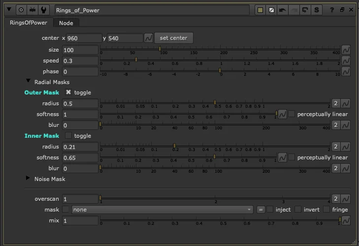

# Rings of Power TL

**Author:** Tony Lyons - [https://compositingmentor.com](https://compositingmentor.com)

<video autoplay loop muted playsinline>
  <source src="../img/tools/draw/rings-of-power-hero.mp4" type="video/mp4">
</video>

An expansion of SpotLight TL, designed around animation. Where SpotLight defines a static ring shape, Rings of Power adds the time dimension — producing looping, animated rings or shockwaves that travel outward from a center point.

### Size and Animation Controls

- **Size** — global scale for the ring, animation-friendly
- **Speed** — controls how fast the rings travel outward
- **Phase** — offsets the animation cycle, useful for staggering multiple instances

### Radial Masks

Same ring-shaping controls as SpotLight — an outer mask and an inner mask, where the inner is subtracted from the outer:

- **Outer Mask / Inner Mask** — independent radius, softness, and blur per mask
- **Toggle** — enable or disable each mask independently

### Noise Mask

An experimental breakup layer that adds irregularity to the ring edge:

- The noise follows the center point and tracks with the ring — it won't swim through the animation as the ring moves
- It attempts to scale with the ring, simulating how a shockwave might break apart as it expands
- It's heavier to compute and a little rough around the edges, but can still yield useful results when you need organic breakup

### Other Controls

- **Set Center** — click to pick the center point directly in the viewer
- **Overscan** — for working in overscanned formats
- **Mask input** — with inject, invert, and fringe options
- **Mix** — global fade or opacity control

### Use Cases

- **Rain shockwaves** — rings expanding on puddles or water surfaces as drops hit
- **Touch interactions** — animate a ring growing from a fingertip or contact point, stagger multiple instances for ripple timing
- **Force field hits** — a laser or projectile striking an energy shield, rings pulsing out from the impact
- **General shockwaves** — explosions, impacts, anything that radiates energy outward

**Inputs:** img (for format) · mask

