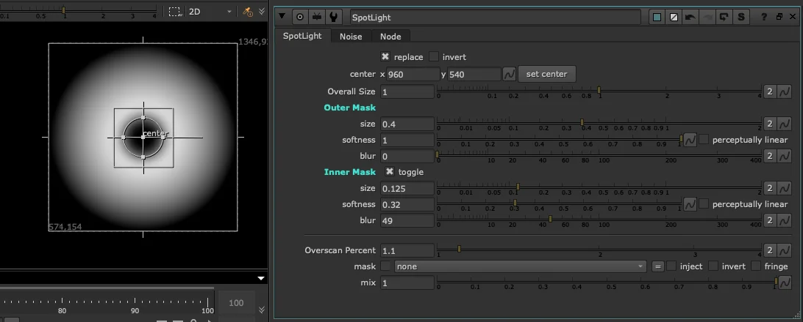

# SpotLight TL

**Author:** Tony Lyons - [https://compositingmentor.com](https://compositingmentor.com)

An expansion of Nuke's Radial node, designed with look dev and animation in mind. SpotLight combines two radials — an outer mask and an inner mask — where the inner is subtracted from the outer to produce a ring shape. Simple in concept, versatile in practice.

### Size Controls

- **Overall size** — scales the entire ring, animation-friendly
- **Outer size / Inner size** — independent control over each radial for shaping the ring width
- **Softness and blur** — per radial, for adjusting the look or animating the edge quality

### Other Controls

- **Replace mode** by default — drop it into a Format node to inherit format size, ideal for templates
- **Invert** — flips the mask
- **Mask input** — for compositing into a specific area
- **Overscan settings** — handled thoughtfully, because you never know
- **Overall mix** — acts as a global fade or opacity control

### Use Cases

SpotLight shines as a base element for effects work:

- **Shockwave animations** — combine with distortion tools for turbulent, expanding rings
- **Tracking data** — parent it to a track and let it follow a path like a moving spotlight
- **Touch interactions** — animate growth and fade, offset the timing, and use Card3D or projection techniques to simulate futuristic UI interactions like someone typing on a holographic pad

Think of it as a procedural ring or circle element ready to be pushed into whatever compositing situation needs it.

**Inputs:** img (for format) · mask
