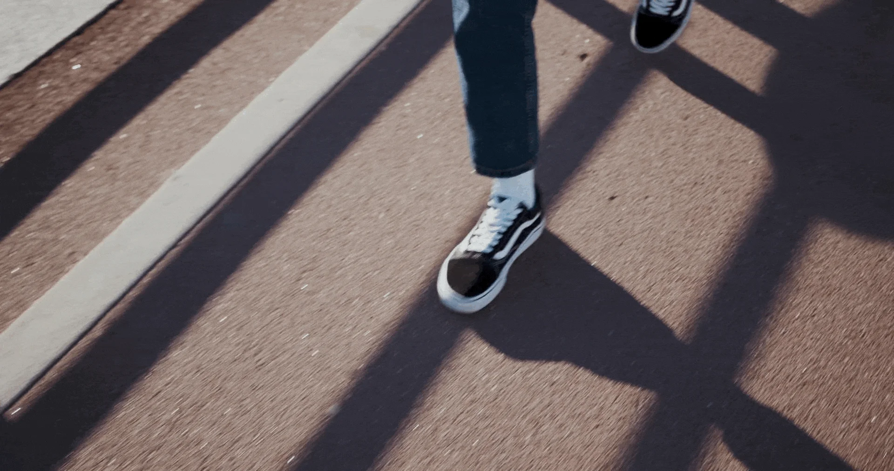
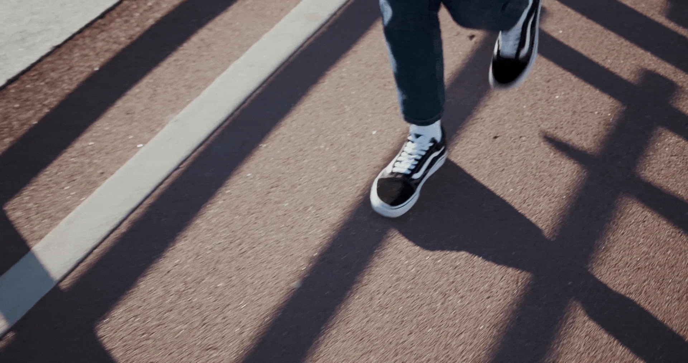
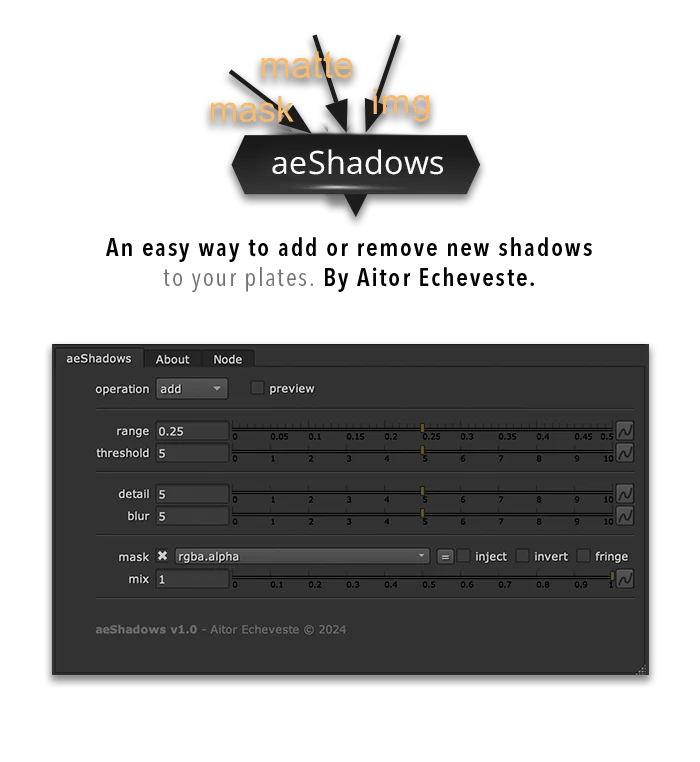

# aeShadows AE

**Author:** Aitor Echeveste

- [https://www.nukepedia.com/gizmos/colour/aeshadows](https://www.nukepedia.com/gizmos/colour/aeshadows)
- Video: [https://vimeo.com/1011834544](https://vimeo.com/1011834544)

Tool to easily add or remove shadows from a plate.

