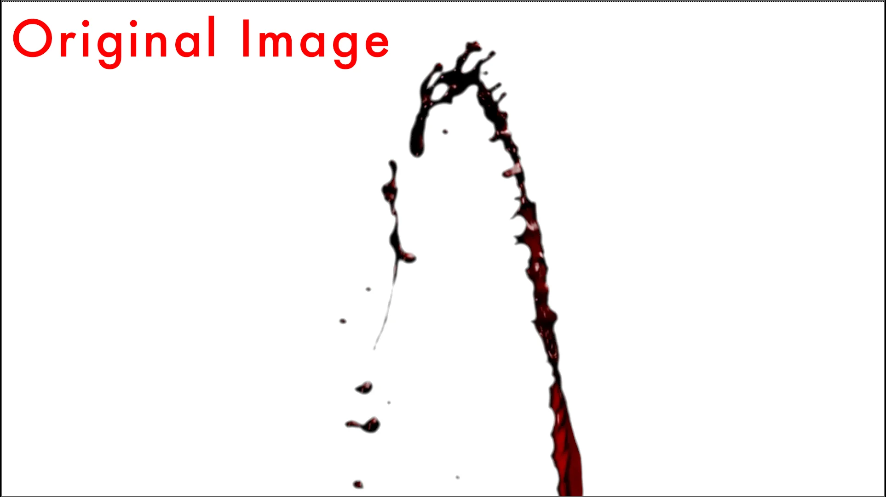
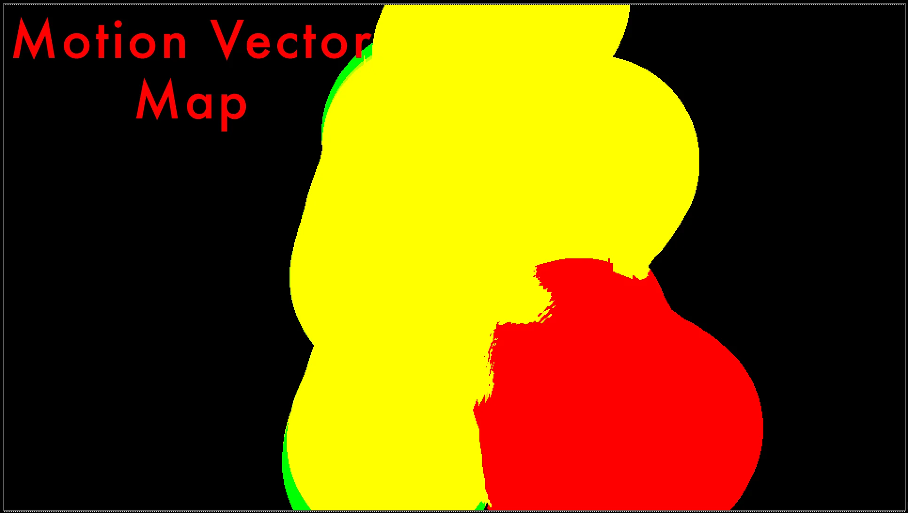
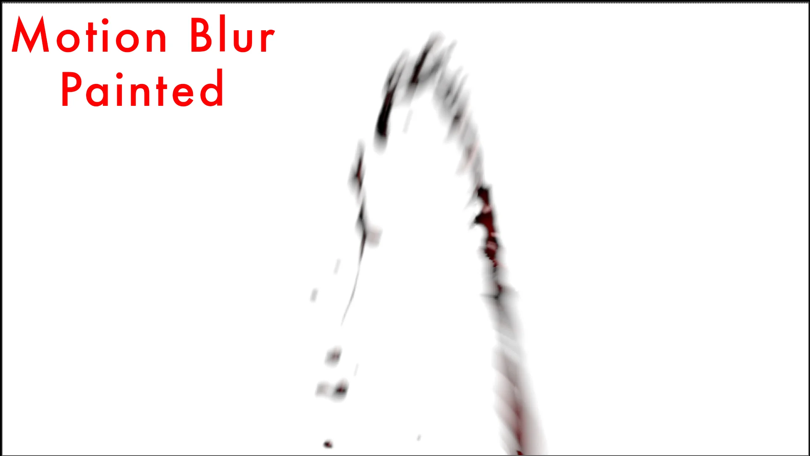
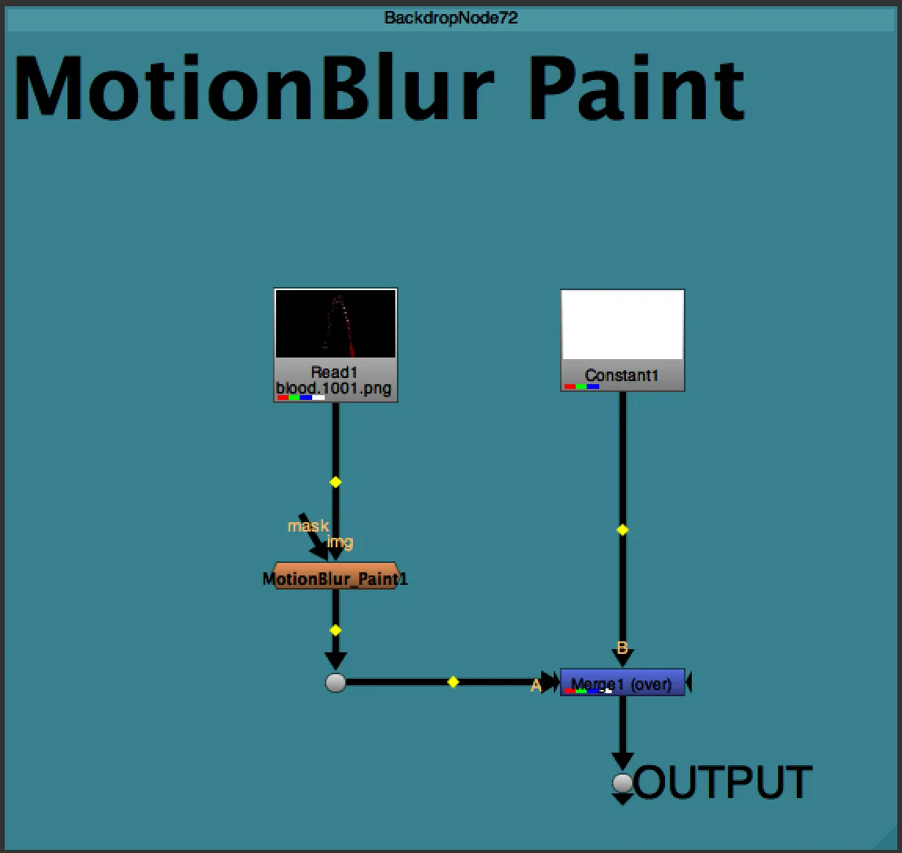
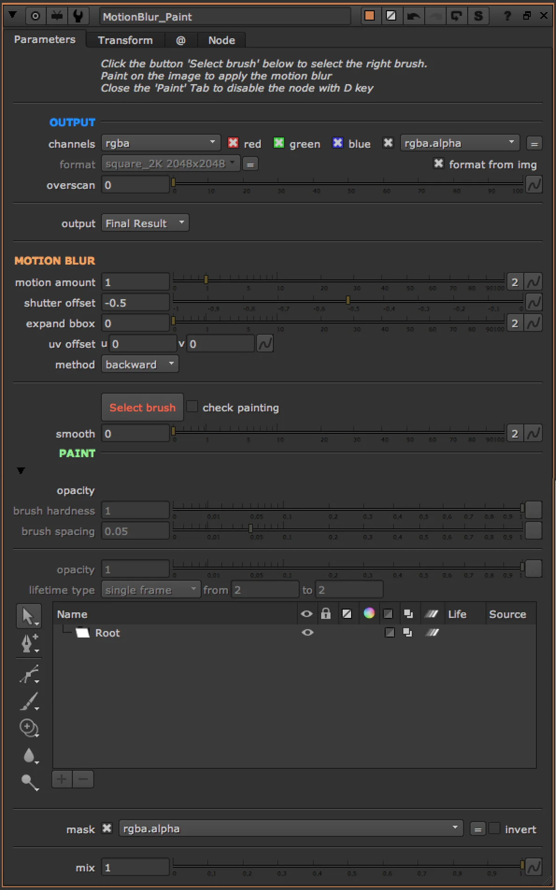

# MotionBlurPaint AG

**Author:** Andrea Geremia - [https://www.andreageremia.it](https://www.andreageremia.it)

- [https://www.nukepedia.com/tools/gizmos/filter/motionblur-paint/](https://www.nukepedia.com/tools/gizmos/filter/motionblur-paint/)
- [https://vimeo.com/526604851](https://vimeo.com/526604851)

Paint the MotionBlur directly on the Viewer.

When you have a Footage, like debris, where every piece shoud have a proper MB, it's hard to get a good result.

With this Gizmo you can paint directly the direction of the MB and control the amount.

Connect your input to the footage, click the button 'Select Brush' and start to paint. If needed, add a bit of 'smooth' with the slider.

Use the controls to modify the amout of the MB.

**Inputs:** img · mask

