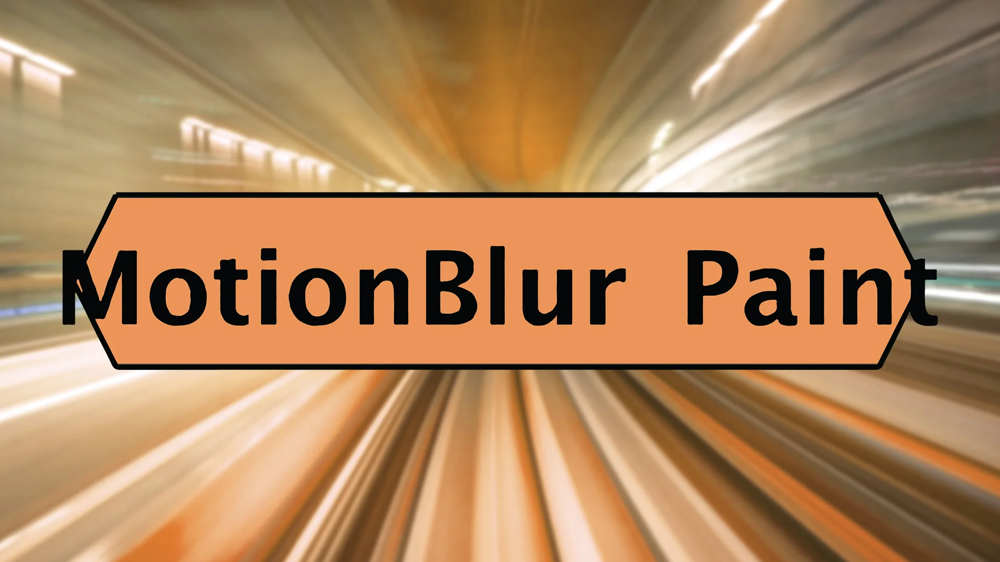

# MotionBlurPaint AG

**Author:** Andrea Geremia - [https://www.andreageremia.it](https://www.andreageremia.it)

- [https://www.nukepedia.com/tools/gizmos/filter/motionblur-paint/](https://www.nukepedia.com/tools/gizmos/filter/motionblur-paint/)

Paint motion blur direction and intensity directly on the viewer using a brush. Particularly useful for footage containing debris, particles, or objects with varying motion directions where every element needs its own motion blur.

Connect your footage, click **Select Brush**, and paint on the image to define motion vectors. The VectorBlur node inside the group applies the blur in the painted direction. Adjust **motion amount** to control blur length, and use the **smooth** slider to soften the painted strokes.

### Controls

- **Motion amount** — scales the overall motion blur length
- **Shutter offset** — shifts the temporal centre of the blur
- **UV offset / Expand bbox** — VectorBlur configuration knobs
- **Smooth** — blurs the painted motion map for softer transitions
- **Output** — switch between the final result or the raw vector map

### Paint controls

- **Opacity / Brush hardness / Brush spacing** — standard RotoPaint brush settings
- **Lifetime type / from / to** — constrain paint strokes to a frame range
- **Mask** — channel-based mask input on the VectorBlur

**Inputs:** img · mask

