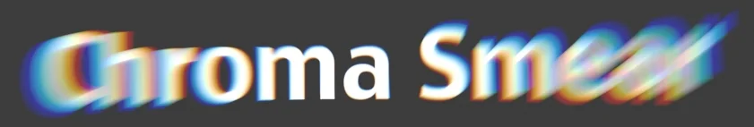

# ChromaSmear LJ

**Author:** Luc Julien

- [https://www.nukepedia.com/tools/gizmos/filter/chromasmear/](https://www.nukepedia.com/tools/gizmos/filter/chromasmear/)

Creates a static motion blur with chromatic shift effects. Similar to Godrays with additional chroma shift. Features vector blur, translate/rotation/scale controls, radial mask, chromatic aberration, and accurate alpha processing.
