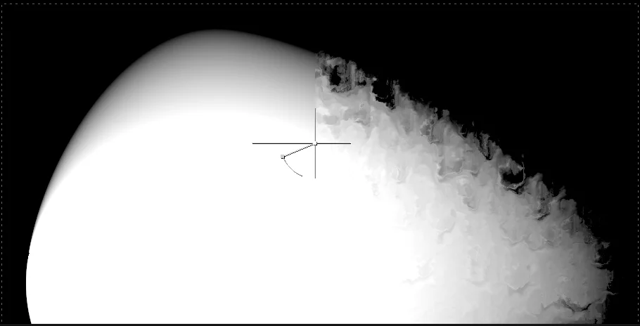
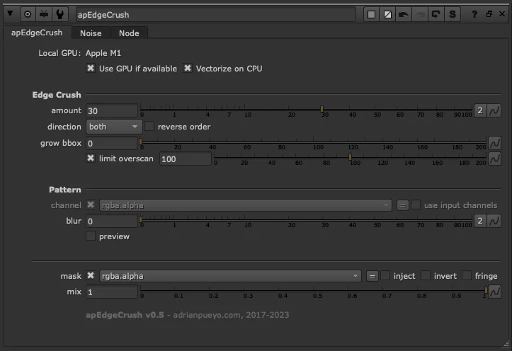
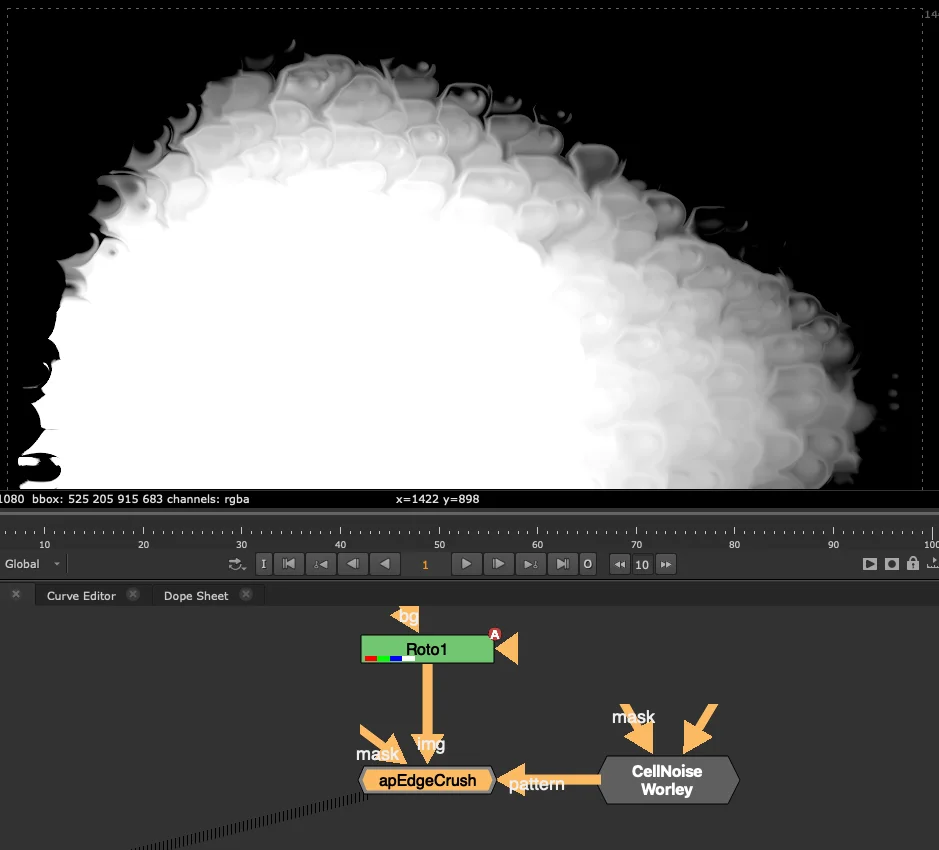

# apEdgeCrush AP

**Author:** Adrian Pueyo - [http://www.adrianpueyo.com](http://www.adrianpueyo.com)

A BlinkScript edge distortion tool that breaks up and smears edges using a push/pull displacement method. Works on alpha channels or full images.

What sets it apart is the **direction** control: pixels can be pushed **forward**, pulled **backward**, or set to **both** — simultaneously pushing and pulling in opposite directions, producing a smearing, crushing effect that creates organic broken-up edges difficult to replicate with standard warp tools.

By default, displacement is driven by Nuke's built-in noise (configurable in the **Noise** tab). Connect an image to the second input to use any custom noise, texture, or pattern instead. Additional controls include **grow bbox**, **limit overscan**, a pattern **blur** for softer falloff, and a **preview** mode to visualise the displacement pattern.

**Inputs:** img · pattern (optional) · mask

