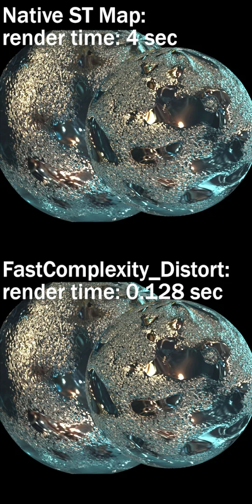

# FastComplexity_Distort MHD

**Author:** Mads Hagbarth Damsbo

- [https://www.nukepedia.com/gizmos/image/fastcomplexitydistort](https://www.nukepedia.com/gizmos/image/fastcomplexitydistort)

Fast implementation of iDistort and STMap for UVs with high complexity/detail. A simple mip implementation for StMap and iDistort that improves render speeds with complex UVs.
