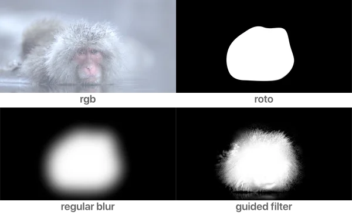

# GuidedBlur RP

**Author:** Rafael Perez - [https://www.rafael.ai](https://www.rafael.ai)

- [https://www.rafael.ai/guided_blur](https://www.rafael.ai/guided_blur)
- [https://www.nukepedia.com/gizmos/filter/guided-blur-refine-edge](https://www.nukepedia.com/gizmos/filter/guided-blur-refine-edge)

Edge-preserving blur filter, useful to add fine details to a roto/matte. Similar to Photoshop's "Refine Edge" feature. The guided filter uses a second image as a guide to preserve edge detail while blurring.

Connect the alpha/roto to the matte input and an RGB image (usually the original plate) to the img input. Control detail using the edge detail slider (recommended values 2–5).
