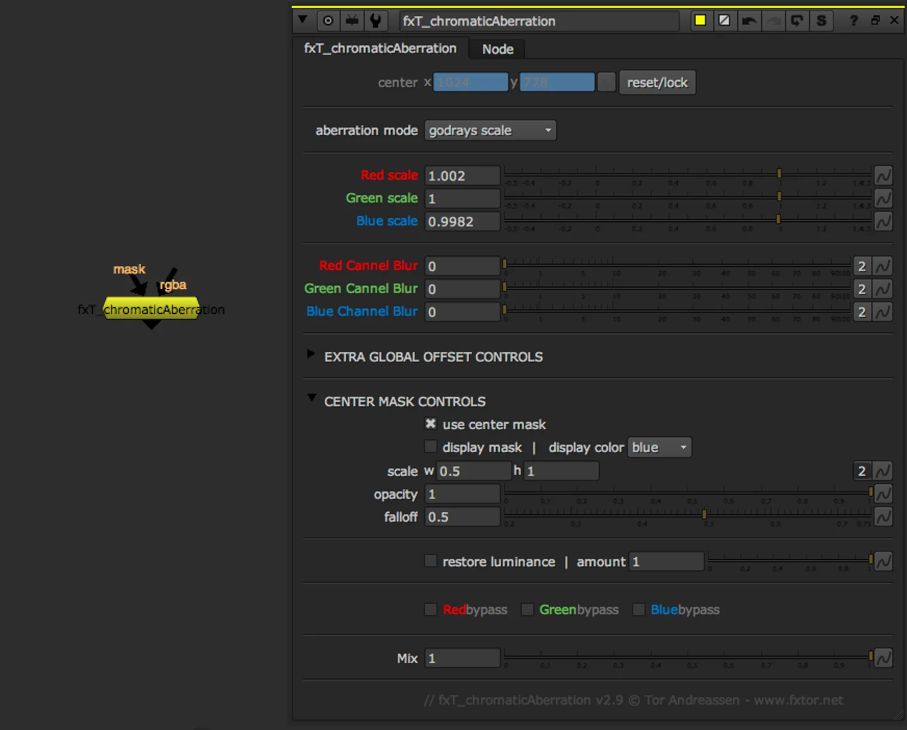
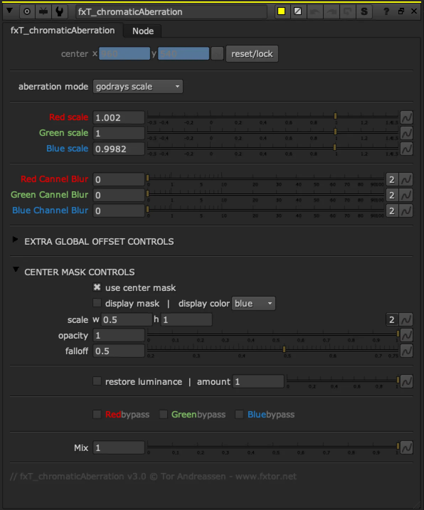

# fxT_ChromaticAberration fxT

**Author:** Tor Andreassen - [https://www.fxtor.net](https://www.fxtor.net)

- [https://www.nukepedia.com/gizmos/filter/chromaticabberation](https://www.nukepedia.com/gizmos/filter/chromaticabberation)

Chromatic aberration gizmo that mimics lens effects. Control over each channel (R,G,B scaling), two aberration modes (godrays/transforms), mask input, center mask option.

