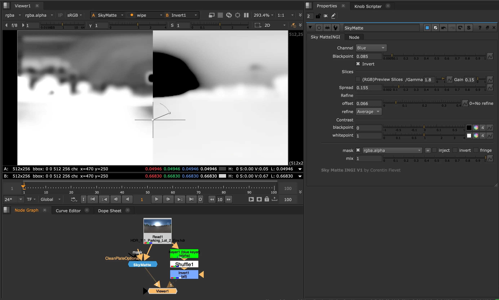
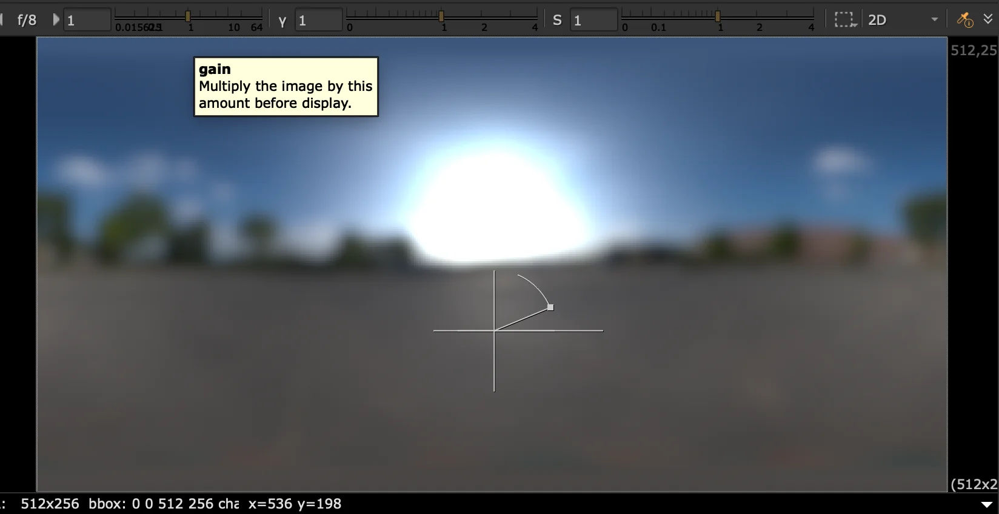
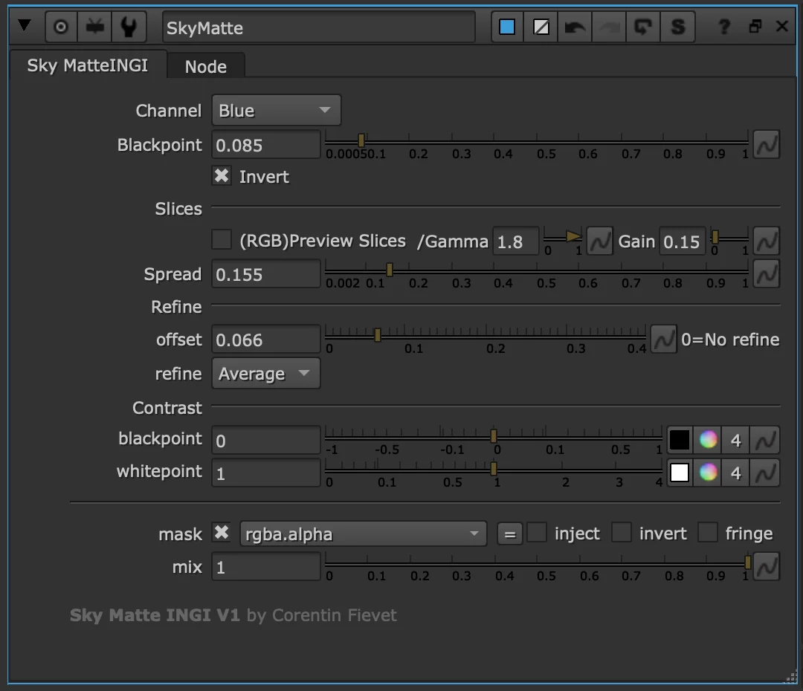

# SkyMatte CF

**Author:** Corentin Fievet - [https://www.linkedin.com/in/corentin-fievet-054964142/](https://www.linkedin.com/in/corentin-fievet-054964142/)

### Overview

Smooth gradients against the sky are especially tough to key — when one section looks right, further along the luminance gradient the key is too sharp or too soft. SkyMatte solves this by slicing the sky gradient into sections and performing a progressive key per section, attempting to capture the flattest key across the range so the sky holds a roughly consistent value rather than being good in one area and breaking down as the sky gets brighter or darker.

### Controls

The main controls are **Blackpoint**, **Spread**, and **Offset**. Refine can be switched between Average (smoother) and Min (more precise). A **RGB slice preview** shows the distribution across the image, and post-process contrast is available to tighten the result.

### Channels

Works on Red, Green, Blue, and Luminance channels for different types of sky extraction.

**Inputs:** img · CleanPlate (optional) · mask

