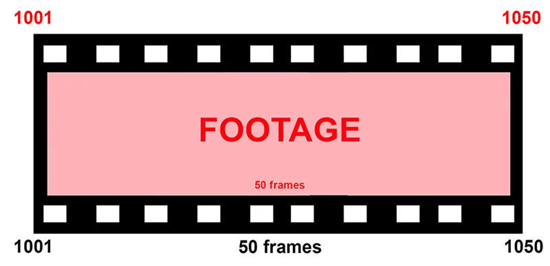
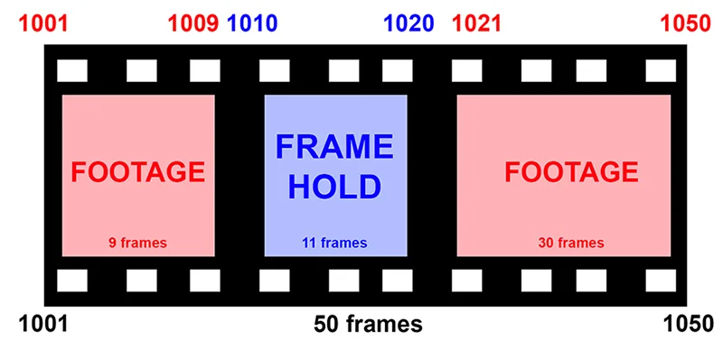
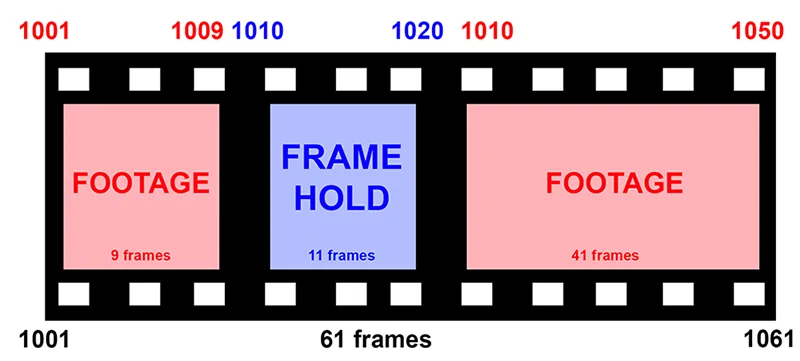

# FrameHold Special AG

**Author:** Andrea Geremia - [https://www.andreageremia.it](https://www.andreageremia.it)

- [https://www.nukepedia.com/tools/gizmos/time/framehold-special/](https://www.nukepedia.com/tools/gizmos/time/framehold-special/)

Classic FrameHold node with more features.

Compared to the classic FrameHold node, this one has something SPECIAL: Pick a frame and use it for the frame range that you prefer!

The gizmo doesn't use keyframe, but just FrameRange and AppendClip.

Here a small explanation:

When you connect the node to the footage, you can choose the frame to hold.

With checkbox 'pause the original plate' you can stop the original footage and then take it back after the FrameHold.

For example, frame range of your Footage is going from 1001 to 1050.

I would like to lock the frame 1010 in this frame range: 1010-1020, like in the previous images

If your checkbox is unchecked, the final frame range will be the same: 1001-1050. Basically the footage won't be stopped, but the Frame Hold will replace the footage in the frame range specified, so 1010-1020.

If your checkbox is checked, the final frame range will be: 1001-1061. That's why the footage will be stopped after frame 1009 (I would like to lock the frame in the frame range: 1010-1020, so for 11 frames). After frame 1020 my footage will restart from frame 1010, when I stopped it before.

At the end my new frame range is 1000-1061.

**Inputs:** img

