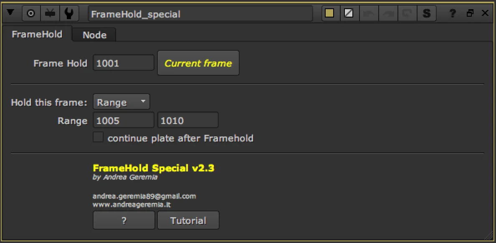
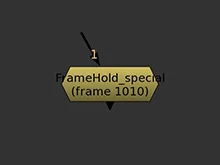
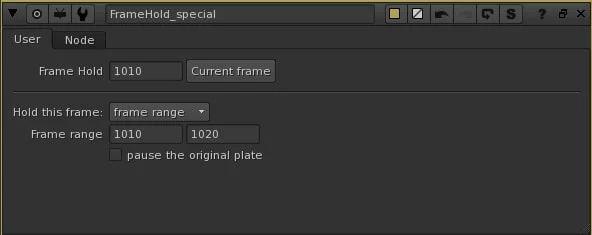
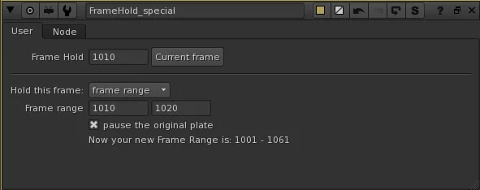

# FrameHold Special AG

**Author:** Andrea Geremia - [https://www.andreageremia.it](https://www.andreageremia.it)

- [https://www.nukepedia.com/tools/gizmos/time/framehold-special/](https://www.nukepedia.com/tools/gizmos/time/framehold-special/)

An enhanced FrameHold that lets you define both the frame to hold and the frame range over which the hold is active — without keyframes.

In **Always** mode it behaves identically to Nuke's built-in FrameHold. In **Range** mode you set a start and end frame; outside that range the original footage plays normally. An optional **continue plate** checkbox causes the footage to resume from the held frame's next frame once the range ends, rather than jumping back to the live plate at the same timecode.

### Usage

1. Connect your footage to the input
2. Set **Frame Hold** to the frame you want frozen
3. Switch type to **Range** and enter a start and end frame
4. Enable **continue plate after Framehold** if you want the plate to resume seamlessly after the hold

**Inputs:** img

