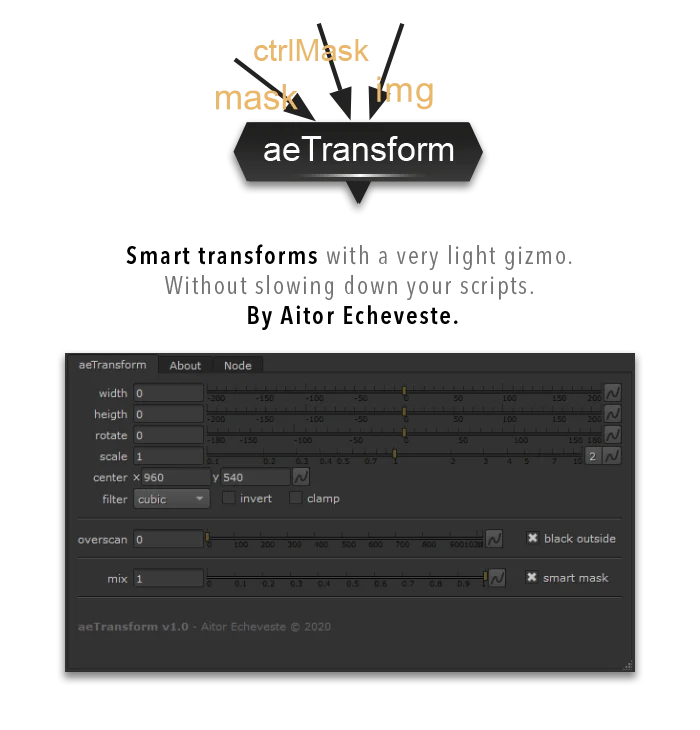
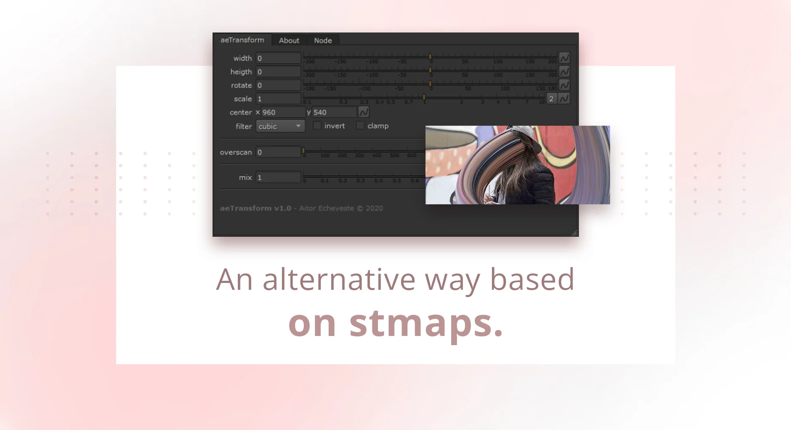

# iTransform_ae AE

**Author:** Aitor Echeveste - [https://aitorecheveste.com](https://aitorecheveste.com)

- [https://aitorecheveste.com/aetransform-overview/](https://aitorecheveste.com/aetransform-overview/)
- [https://www.nukepedia.com/tools/gizmos/transform/aetransform/](https://www.nukepedia.com/tools/gizmos/transform/aetransform/)
- [https://github.com/aitorecheveste/aeTools](https://github.com/aitorecheveste/aeTools)

aeTransform (iTransform_ae) is a lightweight Smart Transform Gizmo for small adjustments to elements without using heavy distortion methods. Unlike IDistort or GridWarp, it performs quick modifications without slowing down scripts.

### Key Features

- **Ultra-Lightweight Processing** – No need for warps or distortions
- **Precise Local Adjustments** – Modify specific areas with masking controls
- **Ideal for Small Transformations** – Perfect for minor shape adjustments
- **Fast Performance** – Works efficiently without slowing down scripts

### How It Works

- Uses a basic transformation model instead of resource-heavy warping
- Allows scaling, rotation, and positional adjustments efficiently
- Masking support lets artists define specific transformation areas
- Works independently of Nuke's distortion nodes

### Best Use Cases

1. **Refining rotoscoped elements** – Small refinements to rotoscoped shapes
2. **Correcting minor misalignments** – Fix small shifts without excessive re-tracking
3. **Masked transformations** – Apply localized transforms to specific image areas
4. **Fast motion adjustments** – Aligning layers, match-moving, or quick position fixes

### How to Use

1. Download from Nukepedia or GitHub; add the gizmo to your script and restart if needed
2. Connect the input image; adjust position, rotation, or scale
3. Enable the mask input to control which areas are affected
4. Toggle bypass to compare before and after

### Best Practices

- Use for small, precise transformations—avoid large-scale warping
- Combine with RotoPaint, Tracker, and Transform nodes
- Precomp static transformations when using multiple Smart Transform nodes

### Common Mistakes

- Applying large distortions (use GridWarp or IDistort instead)
- Forgetting to use masking for targeted transforms
- Stacking too many transformations (consider merging transforms)

For **small transformations**, aeTransform is faster than IDistort or GridWarp. For **complex warping**, use those tools instead.
