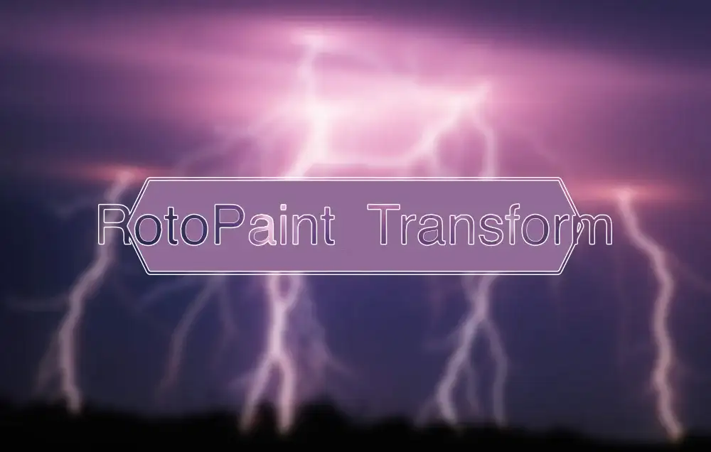

# RotoPaintTransform AG

**Author:** Andrea Geremia - [https://www.andreageremia.it](https://www.andreageremia.it)

- [https://www.nukepedia.com/tools/gizmos/transform/rotopaint-transform/](https://www.nukepedia.com/tools/gizmos/transform/rotopaint-transform/)

Move image elements directly with a brush instead of placing transform nodes or Grid Warp. Paint over the areas you want to shift and the gizmo uses an STMap to apply the warp with frame-accurate control.

Connect your footage, click **Select Brush**, and paint to reposition elements. Each stroke displaces the underlying pixels by the painted offset. Use the **smooth** slider to soften transitions at stroke edges, and the **Mix** knob to blend the result back with the original.

Two internal operation modes are available: **UV Map** (direct remap, no extra controls) and **Vector** (the paint drives an iDistort node, exposing offset and scale knobs for fine-tuning strength).

### Controls

- **Operation** — UV Map or Vector distort mode
- **Filter** — resampling filter used by the STMap (Impulse, Cubic, Keys, etc.)
- **UV offset / UV scale** — available in Vector mode to adjust distortion strength
- **Smooth** — blurs the painted warp map
- **Output** — switch between Final Result, UV Map, or Vector

### Paint controls

- **Opacity / Brush hardness / Brush spacing** — standard RotoPaint brush settings
- **Lifetime type / from / to** — constrain paint strokes to a frame range
- **Mask** — channel-based mask input

### Transform tab

Exposes the internal RotoPaint transform, allowing track data to be linked or baked in.

**Inputs:** img · mask

