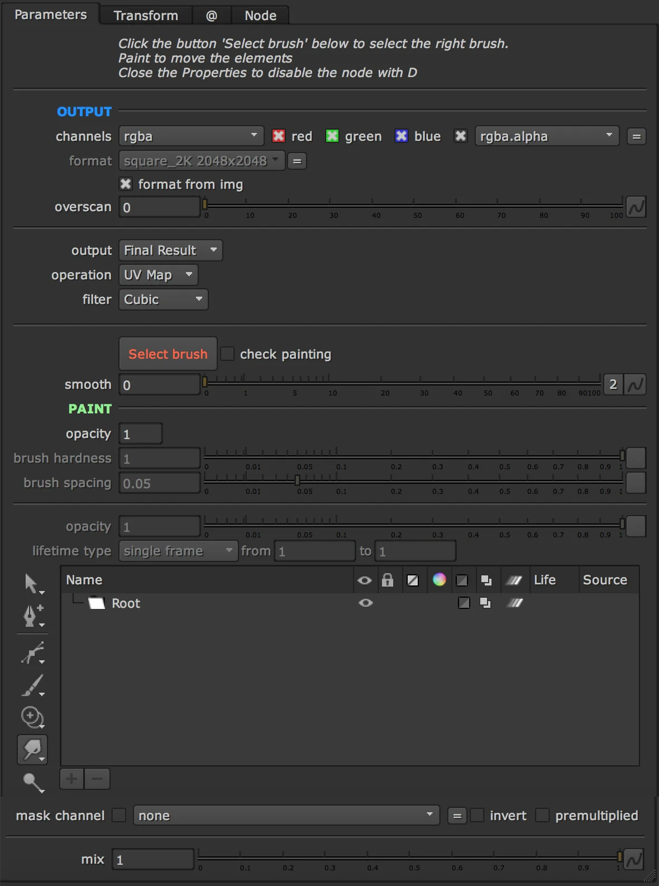

# RotoPaintTransform AG

**Author:** Andrea Geremia - [https://www.andreageremia.it](https://www.andreageremia.it)

- [https://www.nukepedia.com/tools/gizmos/transform/rotopaint-transform/](https://www.nukepedia.com/tools/gizmos/transform/rotopaint-transform/)
- [https://vimeo.com/403958094](https://vimeo.com/403958094)
- [https://youtu.be/5gLyf6db7mk?t=5814](https://youtu.be/5gLyf6db7mk?t=5814)

Move your elements directly with a brush instead of using transform nodes or Grid/Spline Warp.

It's much easier to use this node. You will save a lot of time!

Sometimes you have to move some parts of the plate/element every frame and using Rotoshape and Transform could be really annoying and slow.

With RotoPaint Transform, you can use just the brush to move directly the elements. You can decide the strenght and the smoothness of each brush and animate the mix overall.

Connect the node to the image, click the button 'Select Brush' and start to paint.

Personally I use often this technique with FX and elements like Lightnings, when you want to customize the position of some parts.

**Inputs:** img · mask

<video autoplay loop muted playsinline>
  <source src="../img/tools/transform/roto-paint-transform-4.mp4" type="video/mp4">
</video>

