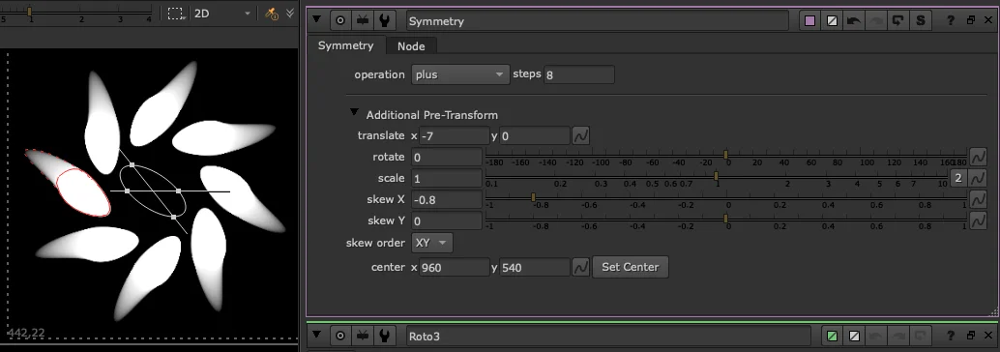

# Symmetry TL

**Author:** Tony Lyons - [https://compositingmentor.com](https://compositingmentor.com)

A kaleidoscope-style image mirroring tool that rotates an object around a center point, repeating it in steps to complete a circle. The more steps, the more times it appears around the center — a little like spinning a mirror in a kaleidoscope.

Great for creative look dev, motion graphics, muzzle flashes, magic FX, or generating interesting abstract backgrounds when combined with grid patterns or noise.

### Steps & Merge

- **Steps** — controls how many times the image is mirrored around the center point
- **Merge operation** — how each mirrored slice blends with the others

### Animation

Where it gets really interesting is with motion. Animated elements take on a life of their own when looped through the symmetry, and animating the distance of the source from the center point — pulling in and pushing out — produces hypnotic, ever-changing patterns. The rest is yours to explore.

**Inputs:** img
