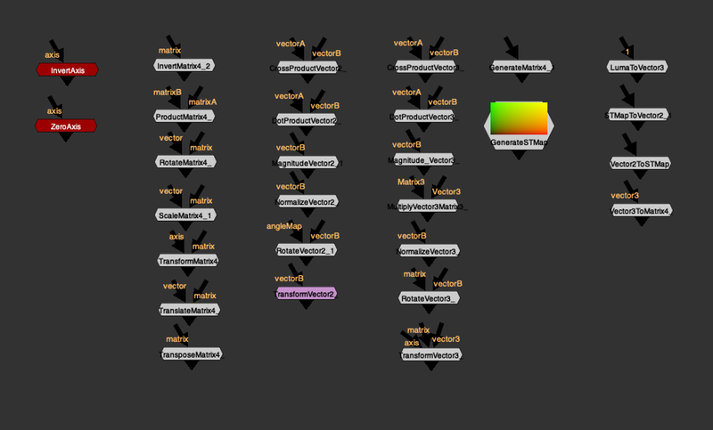
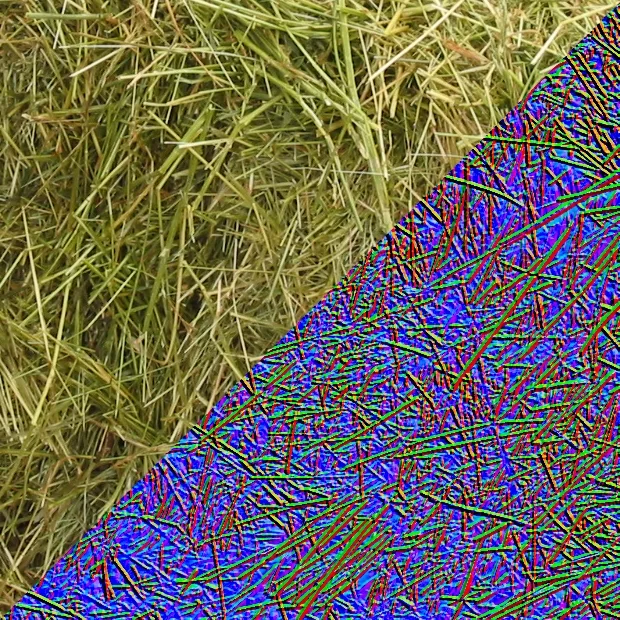

# Vector Math Tools MGA-EL

**Author:** Mathieu Goulet-Aubin & Erwan Leroy - [https://github.com/mapoga/nuke-vector-matrix](https://github.com/mapoga/nuke-vector-matrix)

- [http://www.nukepedia.com/toolsets/transform/vector-matrix-toolset](http://www.nukepedia.com/toolsets/transform/vector-matrix-toolset)
- [http://www.nukepedia.com/toolsets/other/vectortools](http://www.nukepedia.com/toolsets/other/vectortools)
- [https://github.com/mapoga/nuke-vector-matrix](https://github.com/mapoga/nuke-vector-matrix)
- [http://erwanleroy.com/vector-tools-for-nuke-tutorials-and-math/](http://erwanleroy.com/vector-tools-for-nuke-tutorials-and-math/)
- [http://erwanleroy.com/vector-tools-for-nuke-tutorials-and-math-part2/](http://erwanleroy.com/vector-tools-for-nuke-tutorials-and-math-part2/)

Math Tools combines Mathieu Goulet-Aubin & Erwan Leroy's vector tools into 1 main menu.

## Introduction

The toolset is separated into 2 categories. One to operate on vectors3 and one to operate on 4x4 transformation matrices. Every pixel can be worked on independently because each can have its own vector and matrix data.

---

## GenerateSTMap

Generates a default ST Map at any resolution. A Format picker lets you set the output resolution, and an **Overscan (%)** knob (default 10%) expands the map beyond the frame edge — useful when the STMap will be used to drive a lens-distortion workflow where edges need coverage. A **Reformat to Overscan** toggle bakes the overscan into the output format.

- [GitHub — nuke-vector-matrix](https://github.com/mapoga/nuke-vector-matrix)
- [Nukepedia — Vector Matrix Toolset](https://www.nukepedia.com/toolsets/transform/vector-matrix-toolset)

---

## vector3DMathExpression

A NoOp node with built-in expressions that calculates a 3D vector between two points in 3D space and the magnitude (distance) between them. Set **Vector 1** and **Vector 2** to any two 3D positions — the node outputs `v4 = V1 − V2` and `Magnitude_v4 = √(v4.x² + v4.y² + v4.z²)`. Designed to be used alongside Reconcile3D nodes to measure distances or directions in scene space.

- [Nukepedia — VectorTools](https://www.nukepedia.com/toolsets/other/vectortools)
- [Erwan Leroy — Vector Tools for Nuke: The Math](https://erwanleroy.com/vector-tools-for-nuke-tutorials-and-math/)

---

## Resources to learn about Vectors and Matrices

Most tools in this toolset are mathematical tools and require some basic knowledge about Vectors and Matrices for optimal use.

- [https://www.mathsisfun.com/algebra/scalar-vector-matrix.html](https://www.mathsisfun.com/algebra/scalar-vector-matrix.html)
- [https://en.wikipedia.org/wiki/Transformation_matrix](https://en.wikipedia.org/wiki/Transformation_matrix)
- [http://www.nukepedia.com/written-tutorials/using-the-nukemath-python-module-to-do-vector-and-matrix-operations/](http://www.nukepedia.com/written-tutorials/using-the-nukemath-python-module-to-do-vector-and-matrix-operations/)
- [http://www.nukepedia.com/expressions/enter-the-matrix-knob](http://www.nukepedia.com/expressions/enter-the-matrix-knob)

---

### Math > Axis

- **InvertAxis** — Inverts an input Axis.
- **ZeroAxis** — Inverts an input Axis at a specified frame.

### Math > Matrix4

- **InvertMatrix4** — Inverts a pixel-based Matrix4 (defined as layers matrix0, matrix1, matrix2 and matrix3).
- **ProductMatrix4** — Multiplies two pixel-based Matrix4 values (defined as layers matrix0, matrix1, matrix2 and matrix3).
- **RotateMatrix4** — Applies rotation to a pixel-based Matrix4 (defined as layers matrix0, matrix1, matrix2 and matrix3).
- **ScaleMatrix4** — Scales a Matrix4 using a control channel (RGB from vector input), where each channel acts as a scalar for x, y and z.
- **TransformMatrix4** — Applies a full transform to a pixel-based Matrix4 (defined as layers matrix0, matrix1, matrix2 and matrix3).
- **TranslateMatrix4** — Translates a Matrix4 using a control channel (RGB from vector input), where each channel acts as a scalar for x, y and z.
- **TransposeMatrix4** — Transposes a pixel-based Matrix4 (defined as layers matrix0, matrix1, matrix2 and matrix3).

### Math > Vector2

- **CrossProductVector2** — Calculates the cross product of two Vector2 inputs.
- **DotProductVector2** — Calculates the dot product of two Vector2 inputs.
- **MagnitudeVector2** — Calculates the magnitude (scalar) of an input Vector2.
- **NormalizeVector2** — Normalizes the magnitude of a Vector2 to a length of 1.
- **RotateVector2** — Rotates a 2D vector on the same 2D plane.
- **TransformVector2** — Transforms an image assuming it is a motion vector in RGBA. Unlike a regular transform, this edits pixel colors to compensate for vector direction and magnitude. Warning: breaks concatenation.

### Math > Vector3

- **CrossProductVector3** — Calculates the cross product of two Vector3 inputs.
- **DotProductVector3** — Calculates the dot product of two Vector3 inputs.
- **MagnitudeVector3** — Calculates the magnitude (scalar) of an input Vector3.
- **MultiplyVector3Matrix3** — Multiplies (transforms) a Vector3 by a Matrix3 — equivalent to applying Rotation, Scale, and Skew from a Matrix to the vector. A Matrix4 can be used; the last row and column will be ignored.
- **NormalizeVector3** — Normalizes the magnitude of a Vector3 to a length of 1.
- **RotateVector3** — Rotates a Vector3 in 3 dimensions.
- **TransformVector3** — Transforms a Vector3 in 3 dimensions.

### Generate

- **GenerateMatrix4** — Generates a Matrix4 based on a Matrix knob. Defaults to an identity matrix.

### Convert

- **LumaToVector3** — Performs a Sobel filter on the luminance channel of an image to extract an approximation of a normal map. For a mathematical conversion of a displacement map to normals, do not use Details separation.
- **STMapToVector2** — Transforms a distorted UV map to motion vectors corresponding to the distortion.
- **Vector2ToSTMap** — Converts motion vectors to a distorted UV map (STMap). The inverse operation of STMapToVector2.
- **Vector3ToMatrix4** — Generates a 4×4 transformation matrix from a Vector3 input. Supports three interpretations: Translation (x, y, z values used directly), Rotation (orients a chosen axis toward the vector), or Scale (uniform scale from the vector's magnitude).

### Top-level

- **Vectors_Direction** — Edits the direction of motion vectors.
- **Vectors_to_Degrees** — Converts vector directions to a value in degrees.

---

